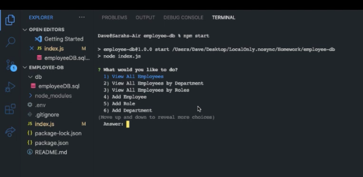
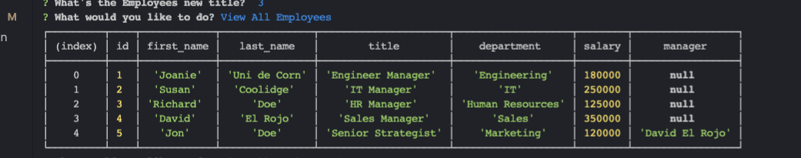
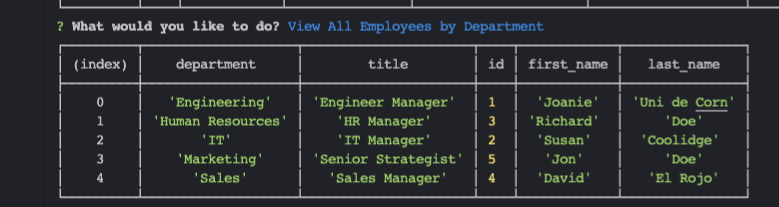

# employee-db
I achieved all that I set out to do.

## Links
<a href="https://drive.google.com/file/d/1I8pDuWoQVujbDJl5dWjqrw5gX0DkC1vu/view">Screencastify</a>
 
<a href="https://github.com/daveyrojo/employee-db">GitHub Repo</a>

## Screen Shots

